# dynamic-cluster
Create A dynamic Jenkins cluster and perform task-3 using the dynamic Jenkins cluster.
Steps to proceed as:

1.  Create container image that’s has Linux  and other basic configuration required to run Slave for Jenkins. ( example here we require kubectl to be configured )

2. When we launch the job it should automatically starts job on slave based on the label provided for dynamic approach.

3. Create a job chain of job1 & job2 using build pipeline plugin in Jenkins 

4.  Job1 : Pull  the Github repo automatically when some developers push repo to Github and perform the following operations as:

    1.  Create the new image dynamically for the application and copy the application code into that corresponding docker image

    2.  Push that image to the docker hub (Public repository) 
 ( Github code contain the application code and Dockerfile to create a new image )

5. Job2 ( Should be run on the dynamic slave of Jenkins configured with Kubernetes kubectl command): Launch the application on the top of Kubernetes cluster performing following operations:

    1.  If launching first time then create a deployment of the pod using the image created in the previous job. Else if deployment already exists then do rollout of the existing pod making zero downtime  for the user.

    2. If Application created first time, then Expose the application. Else don’t expose it.

## My Solution for this problem is:
 
### Initial steps:

* Create the repository from where developer will push the code.

* Configure the hooks so that whenever the developer commit the code it will automaically puch the code to github.

### Step 1: Create container image that’s has Linux  and other basic configuration required to run Slave for Jenkins. ( example here we require kubectl to be configured )

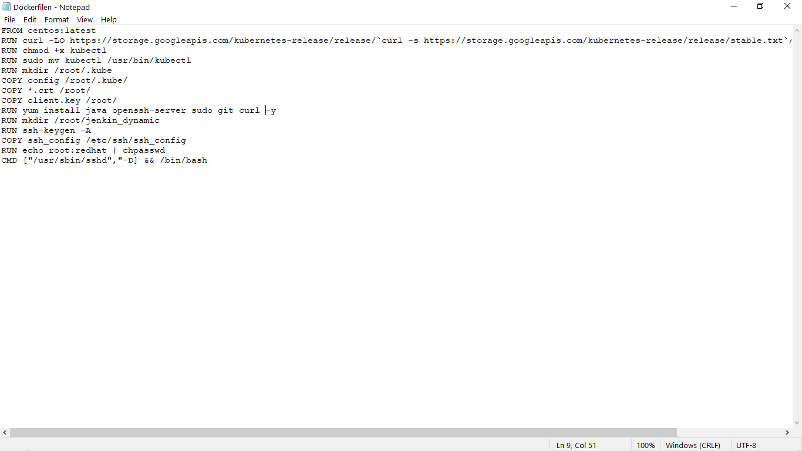

### Step 2: When we launch the job it should automatically starts job on slave based on the label provided for dynamic approach.

### Step 3: Create a job chain of job1 & job2 using build pipeline plugin in Jenkins

#### JOB 1: Pull  the Github repo automatically when some developers push repo to Github and perform the following operations as:
      
	  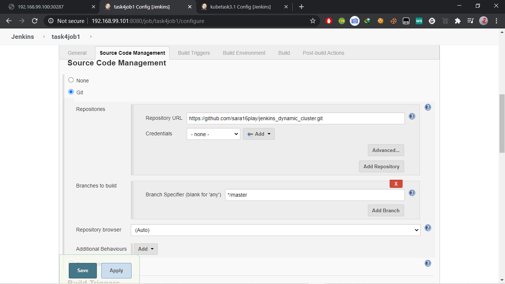
	  
    1.  Create the new image dynamically for the application and copy the application code into that corresponding docker image

    2.  Push that image to the docker hub (Public repository) 
 ( Github code contain the application code and Dockerfile to create a new image )
 
 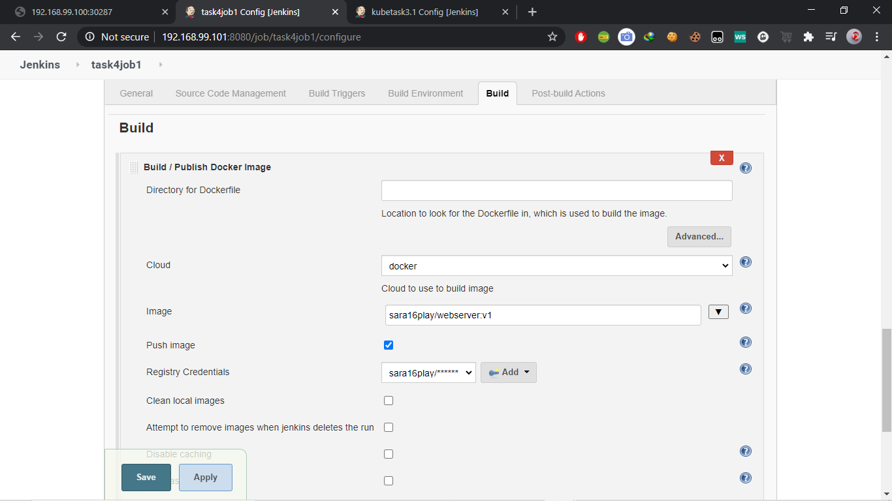

#### Job2 ( Should be run on the dynamic slave of Jenkins configured with Kubernetes kubectl command): Launch the application on the top of Kubernetes cluster performing following operations:

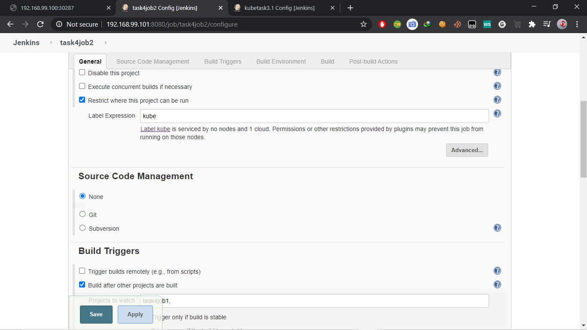

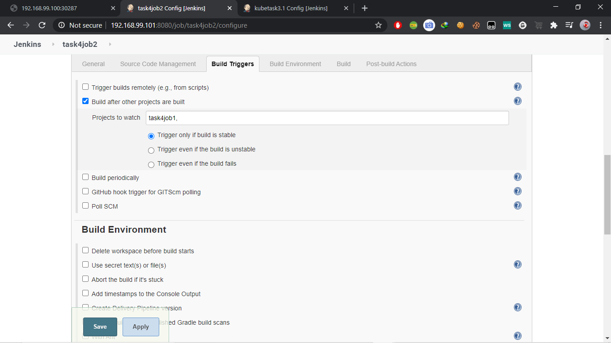

    1.  If launching first time then create a deployment of the pod using the image created in the previous job. Else if deployment already exists then do rollout of the existing pod making zero downtime  for the user.

    2. If Application created first time, then Expose the application. Else don’t expose it.

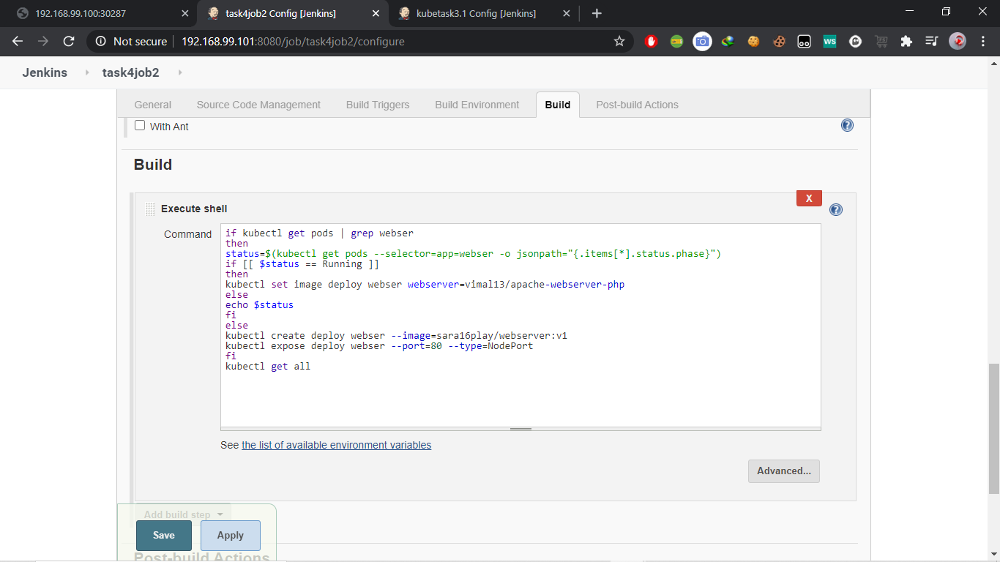

### All the setup has been done, Now check that it is creating the cluster dynamic or not 

* Before the jobs start
 
 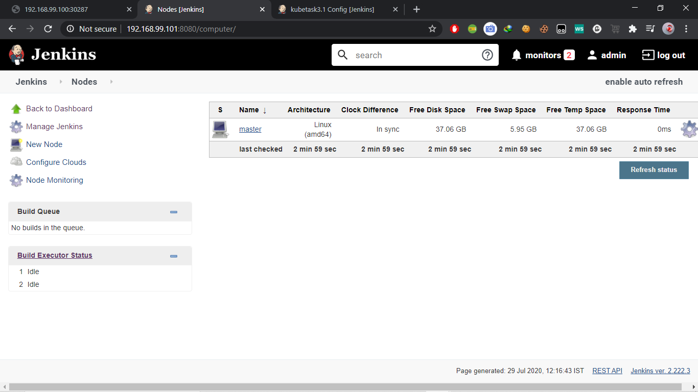

* After jobs starts
 
 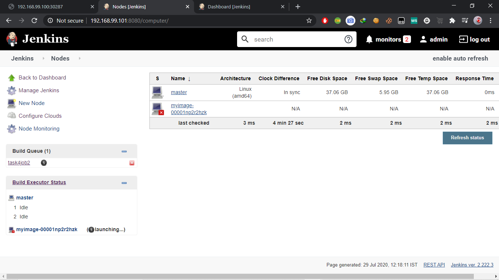
 
 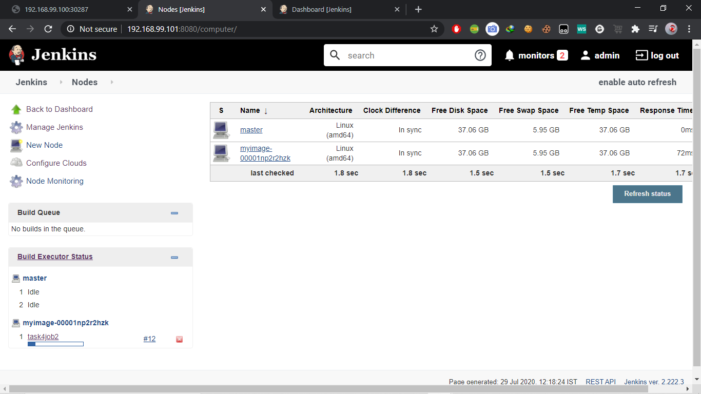

### Outputs:

* After running the jobs we have to enter the ip of the host os and the port no.

* If first time launched..

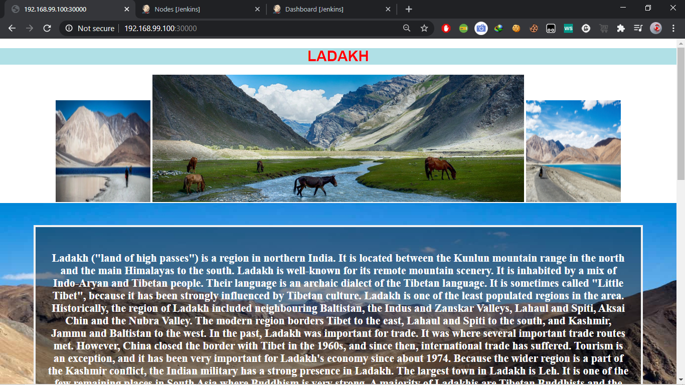

* Then images changes it automatically change in the pods without downtime.

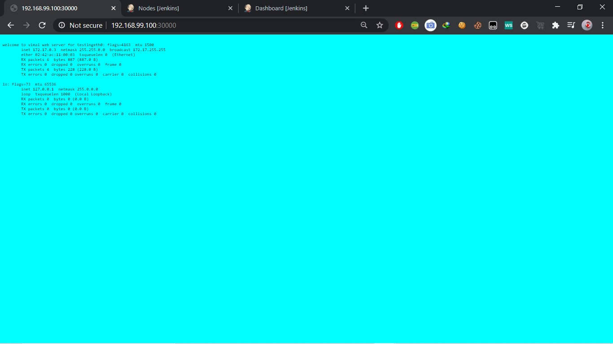

### Note

The pods are launced using Replica set so it will monitor the continers running, if they fails or stops by any reasons then ReplicaSet automatically starts or launch the OS within a sec with the same confirguration.

## Built With

* RHEL-8 Running in Virtual Box

* Kubernetes installed by minikube and also running in RHEL 8

* Git & GitHub

* Jenkins

## Author

[SAURAV PATEL](https://www.linkedin.com/in/saurav-patel-148539151/)
